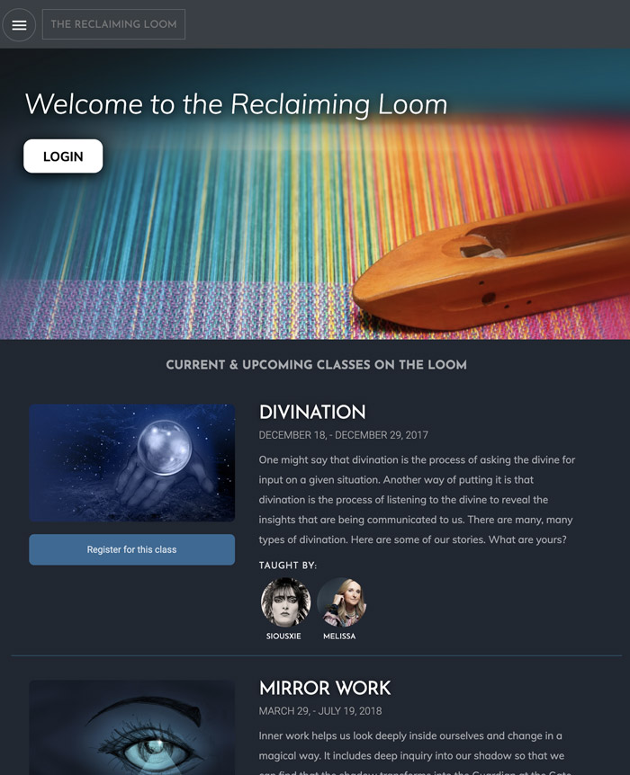

# The Loom Backend / API
This is the back-end of a content management system built in Node.js for an online university called Axis Mundi.


# Table of contents
1. [Installation](#Installation)
2. [Usage](#Usage)
3. [Live Demo](#Live_Demo)
4. [License](#License)
5. [Features](#Features)
6. [Technology](#Technology)
7. [Badges](#Badges)
8. [User Story](#User_Story)
<a name="Installation"></a>
## Installation
```sh
npm install
```
<a name="Usage"></a>
## Usage
```sh
node server
```
<a name="Live_Demo"></a>
## Live Demo
https://thawing-reaches-29763.herokuapp.com/
<a name='License'></a>
## License
[](https://lbesson.mit-license.org/)
<a name="Features"></a>
## Features
1. User Accounts
2.  Admin Dashboard
3.  Content Managment System
4.  Instant Messaging
5.  Registration
<a name="Technology"></a>
## Technology
1. Angular2+
2.  Javascript
3.  Sass
<a name="Badges"></a>
## Badges
 [](https://shields.io/)

**on github:** <a href='github.com/b0rgBart3'>b0rgBart3</a>

[](https://github.com/remarkablemark)

Email: borgBart3@gmail.com
<a name="User_Story"></a>
## User Story
```sh
As a student of metaphysical studies I want to be able to view course offerings, create and account, register for classes and read course material and watch related videos, and chat with my instructors and fellow classmates.
```
